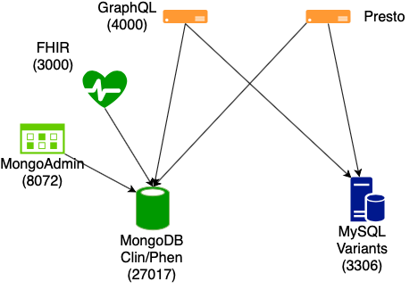

# GraphQL/PRESTO testbed for clinical/genomic searches



This is a testbed containing a FHIR clinical data store (Synthetic Health's [GoFHIR](https://github.com/synthetichealth/gofhir)
running on top of MongoDB) and a simple Gemini-style variant database running MySQL, for testing GraphQL and Presto searching
across different types of data stores.  A diagram showing services and localhost port numbers is shown above.

This currently borrows heavily from https://github.com/medaymenTN/NodeJsGraphQLDockerApp .

## Requirments 

You will need docker and docker-compose installed on your machine.  In addition, to add the
test data to the services you will need local installs of mongodb and a mysql client. `jq` isn't
necessary but makes viewing JSON responses much nicer.  The [`snappy`](https://github.com/andrix/python-snappy)
package is needed to parse the genotypes in the gemini-based variants DB.

## Installation 

* clone the project from the repo 
* cd -> project directory and run your project using the following command 
 ```
docker-compose up 
 ```

### Step 1 - FHIR DB

It will take a minute for the MongoDB to come up, and only after that will the front-end
services stop restarting as they can successfully connect to Mongo.
 
To load the clinical data (taken from the [Synthetic Mass](https://syntheticmass.mitre.org/download.html) 
subsample of 1000 synthetic patients), run the following:
```
cd data/ingest
tar -xzvf mongo_fhir_dump.tgz
mongorestore dump
```

From there, FHIR API searches should work such as:

Listing three patients:
```
curl "http://localhost:3001/Patient?_count=3" | jq
```

Showing all patients that have had a nasal endoscopy procedure (this one will take a few seconds):
```
curl "http://localhost:3001/Patient?_has:Procedure:patient:code=112790001" | jq
```

You can take a closer look at the MongoDB with the admin-mongo interface displayed on http://localhost:8082/.
Create a connection to `mongodb://mongo/fhir` with any name, then start the connection and examine the collections.

### Step 2 - Variants DB

To load the variant data into the database, first grant access to the `dbuser` user to connect from outside the container:

```
mysql -h 127.0.0.1 -uroot -prootpass -P 3306
GRANT ALL PRIVILEGES ON VAR_DB.* to 'dbuser'@'%';
^D
```

then uncompress the mysql dump of the variant data:
```
gunzip mysql_var_dump.gz
```

Then log in as `dbuser` and ingest the dump of the variant database:
```
mysql -h 127.0.0.1 -udbuser -puserpass var_db < mysql_var_dump
```

Now you can check to make sure the table has been loaded:
```
select count(*) from variants;
# +----------+
# | count(*) |
# +----------+
# |    19997 |
# +----------+
# 1 row in set (0.62 sec)
```

### Step 3 - Linking the two

Finally, run the script to generate the `calls` database in the variants DB which links variants called in
a sample to a given patient ID:

```
pip3 install -r requirements.txt
cd data/ingest
./generate_gt_table.py
```

